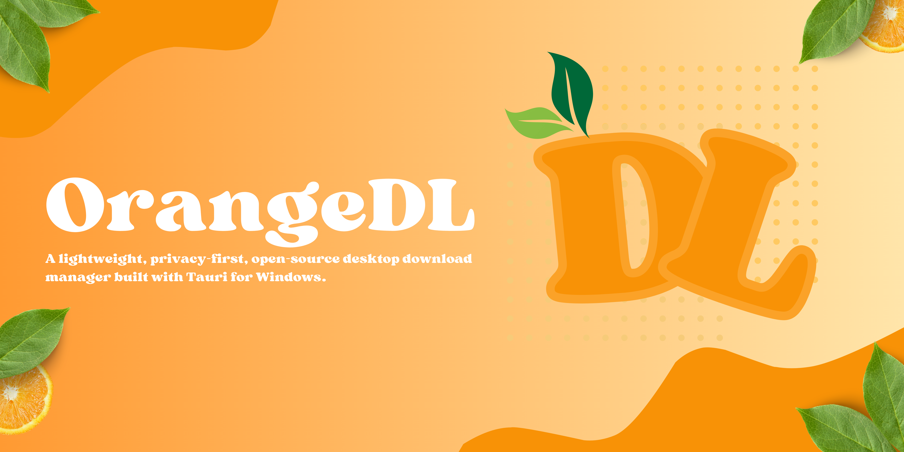

# OrangeDL

<p align="center">
  
</p>

<p align="center">
  <em>A Windows-first desktop download manager focused on HTTP(S) transfers, local history, and a clean Tauri-based workflow.</em>
</p>

<div align="center">

[](https://github.com/misplacedorange/OrangeDL/stargazers)
[](https://github.com/MisplacedOrange/OrangeDL/blob/main/LICENSE)
[](https://www.rust-lang.org)
[](https://tauri.app)
[](https://github.com/misplacedorange/OrangeDL/releases)
[](https://github.com/sponsors/MisplacedOrange)

</div>

## Current Features

- Add downloads from HTTP or HTTPS URLs
- Download from YouTube, Bilibili, and other platforms supported by [yt-dlp](https://github.com/yt-dlp/yt-dlp) (automatic detection and one-click install)
- Run multiple downloads concurrently
- Use pause, resume, cancel, and retry controls
- Attempt partial-file resume with HTTP `Range` support when the server allows it
- Store local download records and app settings in SQLite under the app data directory
- Write to `.part` files until transfers complete
- Show progress, speed, status, and ETA when the app has enough transfer information
- Search, filter, and review download history
- Apply optional per-download speed limits
- Drag and drop URLs into the downloads page
- Keep active transfers running when the main window is hidden to the tray
- Keyboard shortcuts for common actions (pause, resume, cancel)

## Current Limits

OrangeDL is still an early Windows-first project. Before treating a public release as broadly ready, the project still needs stronger downloader integration coverage, release workflow hardening, and installer trust decisions.

- HTTP and HTTPS are the supported download protocols; video platform downloads require yt-dlp
- Browser extension integration, torrents, credential/cookie-authenticated downloads, cloud sync, and scheduling are not supported
- Resume behavior depends on the remote server's HTTP `Range` support and may fall back to restarting or failing the transfer
- Global speed limiting is still being hardened; use per-download limits when exact caps matter
- Windows installers should be treated as unsigned unless a release explicitly says otherwise

---

## Installation

When a release is available, download it from GitHub. The bootstrapper (`orangedl-bootstrap`) can automatically fetch and run the correct release for your platform.

OrangeDL stores app data in the platform-specific application data directory managed by Tauri. Download records and related metadata are persisted locally on the user's machine.

### Windows trust / signing

Current Windows release artifacts should be treated as unsigned unless the release notes explicitly state that they are Authenticode-signed. The NSIS installer is configured for per-machine installation, so Windows may show a User Account Control prompt and SmartScreen may warn about an unknown publisher.

Verify the published SHA-256 checksum sidecar before installing. A checksum helps confirm that the downloaded file matches the release artifact, but it does not prove publisher identity and does not replace code signing. Release packaging, checksum verification, and Windows QA steps are documented in [docs/release.md](docs/release.md).

### Privacy Policy

OrangeDL is a local desktop application. It does not operate a hosted OrangeDL account system or an OrangeDL-controlled cloud service.

- OrangeDL stores download records, status data, file paths, and related app settings locally on the user's device
- OrangeDL may connect to third-party servers when the user starts or manages a download, and the optional bootstrapper may contact GitHub or a user-provided HTTPS asset URL
- OrangeDL does not sell user data
- OrangeDL does not guarantee the privacy, availability, legality, or integrity of third-party content downloaded through the app
- Users are responsible for reviewing the sources they download from and for complying with applicable laws, license terms, and website policies

Full policy: [docs/privacy-policy.md](docs/privacy-policy.md)

### Terms and Conditions

By using OrangeDL, users agree that they are solely responsible for how they use the application.

- OrangeDL is provided as a general-purpose download tool
- I do not control, monitor, or direct what users download, share, copy, or distribute with the application
- I am not responsible for piracy, copyright infringement, unlawful distribution, or other illegal acts committed by users through or alongside the application
- Users must ensure their use of OrangeDL complies with local law and the rights of content owners
- The software is provided without warranty, subject to the GNU General Public License and the project terms

Full terms: [docs/terms-and-conditions.md](docs/terms-and-conditions.md)

---

## Building From Source

This project is currently Windows-first. The maintained desktop build path is Tauri v2 with a Rust backend and a React frontend.

Requirements:
- Node.js 20 or newer
- Rust stable toolchain
- Tauri v2 system prerequisites for your OS
- On Windows, Microsoft WebView2 runtime and Visual Studio Build Tools are typically required

Setup:

```powershell
git clone https://github.com/MisplacedOrange/OrangeDL.git
cd OrangeDL
npm ci
```

Run the app in development:

```powershell
npm run tauri dev
```

Build a production desktop app:

```powershell
npm run tauri build
```

Useful validation commands:

```powershell
npm run build
cd src-tauri
cargo fmt --all -- --check
cargo check --locked
cargo clippy --all-targets --locked -- -D warnings
```

Release packaging and Windows QA steps are documented in [docs/release.md](docs/release.md).

---

## Support the project

You can support the project by starring the repository, reporting issues clearly, and sharing OrangeDL with people who need a desktop download manager.

- [GitHub Sponsors](https://github.com/sponsors/MisplacedOrange)
- [Buy me a Coffee](https://buymeacoffee.com/misplacedorange)

## License

This project is licensed under the [GNU General Public License v3.0](LICENSE).
